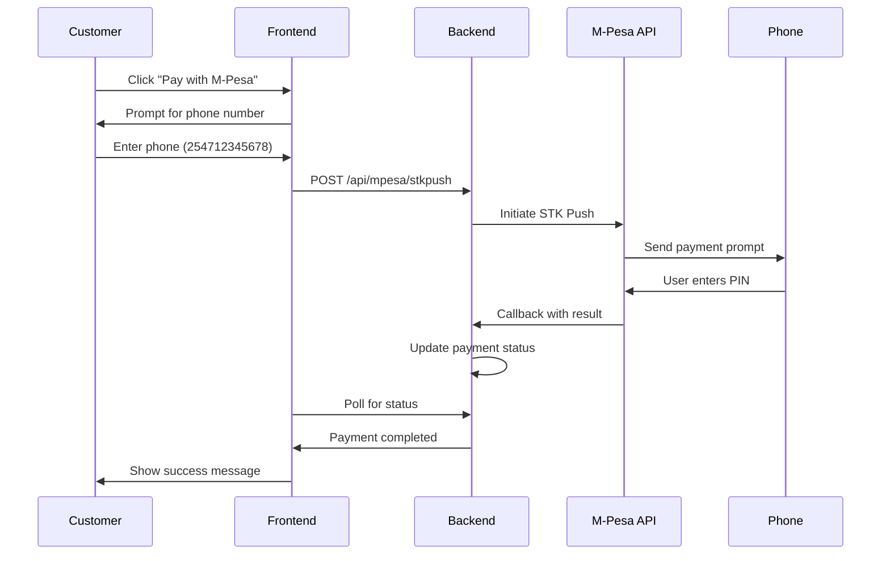

# 💰 M-Pesa Payment Integration

<div align="center">


**Lipa Na M-Pesa Online Integration for Smart Storage Management System**

[Quick Start](#-quick-start) • [Documentation](#-documentation) • [Testing](#-testing) • [Support](#-support)

</div>

---

## 🎯 Overview

This integration enables your Smart Storage Management System to accept M-Pesa payments using Safaricom's Daraja API (Lipa Na M-Pesa Online - STK Push).

### ✨ Features

- 📱 **STK Push** - Automatic payment prompt on customer's phone
- ⚡ **Real-time Processing** - Instant payment confirmation
- 🔒 **Secure** - Industry-standard security practices
- 🔄 **Automatic Updates** - Payment status updates automatically
- 📊 **Transaction Tracking** - Complete payment history
- 🧪 **Sandbox Testing** - Test before going live

---

## 🚀 Quick Start

### Prerequisites

- Python 3.8+
- Flask application running
- Safaricom Developer Account
- ngrok (for local testing)

### 1️⃣ Get M-Pesa Credentials

```bash
# Visit Safaricom Developer Portal
https://developer.safaricom.co.ke/

# Create an app and get:
# - Consumer Key
# - Consumer Secret  
# - Passkey
# - Business Short Code
```

### 2️⃣ Install Dependencies

```bash
cd server
pip install -r requirements.txt
```

### 3️⃣ Configure Environment

```bash
# Copy environment template
cp .env.example .env

# Edit .env with your credentials
nano .env
```

### 4️⃣ Setup Callback URL

```bash
# Install ngrok
brew install ngrok

# Start ngrok
ngrok http 5001

# Copy HTTPS URL to .env
# Example: https://abc123.ngrok.io
```

### 5️⃣ Update Database

```bash
# Run migration
flask db migrate -m "Add M-Pesa fields to Payment"
flask db upgrade
```

### 6️⃣ Test & Run

```bash
# Test your setup
python test_mpesa.py

# Start server
python app.py
```

---

## 📚 Documentation

| Document | Description |
|----------|-------------|
| [**MPESA_INTEGRATION_SUMMARY.md**](MPESA_INTEGRATION_SUMMARY.md) | 📋 Complete overview |
| [**MPESA_QUICK_START.md**](MPESA_QUICK_START.md) | ⚡ 5-minute setup guide |
| [**MPESA_SETUP_GUIDE.md**](MPESA_SETUP_GUIDE.md) | 📖 Full setup instructions |
| [**MPESA_ARCHITECTURE.md**](MPESA_ARCHITECTURE.md) | 🏗️ System architecture |
| [**MPESA_IMPLEMENTATION_CHECKLIST.md**](MPESA_IMPLEMENTATION_CHECKLIST.md) | ✅ Progress tracker |

---

## 🔄 Payment Flow



---

## 🧪 Testing

### Sandbox Credentials

```
Test Phone Numbers:
- 254708374149
- 254712345678

Test PIN: 1234
Shortcode: 174379
```

### Test Script

```bash
# Run comprehensive test
python test_mpesa.py

# Expected output:
# ✅ All credentials found
# ✅ Access token obtained
# ✅ STK Push sent successfully
```

### Manual Testing

1. Create a booking in your app
2. Navigate to payment page
3. Select "M-PESA" payment method
4. Enter test phone number: `254708374149`
5. Wait for auto-completion (sandbox)
6. Verify payment status updates

---

## 📁 Project Structure

```
Smart-Storage-Management-System/
├── server/
│   ├── mpesa_service.py          # 🆕 M-Pesa API integration
│   ├── app.py                    # ✏️ Added M-Pesa endpoints
│   ├── models.py                 # ✏️ Added M-Pesa fields
│   ├── config.py                 # ✏️ Added M-Pesa config
│   ├── test_mpesa.py             # 🆕 Test script
│   ├── .env.example              # 🆕 Environment template
│   └── requirements.txt          # ✏️ Added dependencies
│
├── client/src/components/
│   └── Payment.js                # ✏️ M-Pesa payment flow
│
└── Documentation/
    ├── MPESA_INTEGRATION_SUMMARY.md
    ├── MPESA_QUICK_START.md
    ├── MPESA_SETUP_GUIDE.md
    ├── MPESA_ARCHITECTURE.md
    └── MPESA_IMPLEMENTATION_CHECKLIST.md
```

**Legend**: 🆕 New File | ✏️ Modified File

---

## 🔌 API Endpoints

### Initiate Payment (STK Push)

```http
POST /api/mpesa/stkpush
Content-Type: application/json

{
  "booking_id": 123,
  "phone_number": "254712345678",
  "amount": 5000
}
```

**Response:**
```json
{
  "success": true,
  "message": "Please check your phone and enter M-Pesa PIN",
  "checkout_request_id": "ws_CO_123456789"
}
```

### Payment Callback (Webhook)

```http
POST /api/mpesa/callback
```

M-Pesa calls this endpoint with payment results.

### Query Payment Status

```http
POST /api/mpesa/query

{
  "checkout_request_id": "ws_CO_123456789"
}
```

---

## 🔒 Security

- ✅ Environment variables for credentials
- ✅ HTTPS required for callbacks
- ✅ No hardcoded secrets
- ✅ Secure token generation
- ✅ Callback validation
- ✅ Transaction logging
- ✅ Rate limiting ready

---

## 🐛 Troubleshooting

<details>
<summary><b>❌ "Failed to get access token"</b></summary>

**Solution:**
- Verify Consumer Key and Secret in `.env`
- Check you're using correct API URL (sandbox vs production)
- Ensure credentials are from correct environment
</details>

<details>
<summary><b>❌ "Callback not received"</b></summary>

**Solution:**
- Ensure ngrok is running: `ngrok http 5001`
- Verify callback URL in `.env` matches ngrok URL
- Check callback URL is HTTPS
- Review server logs: `tail -f server.log`
</details>

<details>
<summary><b>❌ "Invalid phone number"</b></summary>

**Solution:**
- Use format: `254XXXXXXXXX`
- Remove `+`, spaces, or dashes
- Ensure number starts with `254` (Kenya country code)
</details>

<details>
<summary><b>❌ "Payment timeout"</b></summary>

**Solution:**
- In sandbox: Wait 30 seconds for auto-completion
- In production: User must enter PIN within 60 seconds
- Implement retry mechanism
</details>

---

## 📊 Database Schema

### Payment Table (Updated)

```sql
CREATE TABLE payment (
    payment_id INTEGER PRIMARY KEY,
    booking_id INTEGER,
    user_id INTEGER,
    amount NUMERIC(10, 2),
    payment_method VARCHAR(30),
    payment_date DATETIME,
    status VARCHAR(20),
    transaction_id VARCHAR(200),
    
    -- M-Pesa specific fields
    mpesa_receipt_number VARCHAR(100),
    checkout_request_id VARCHAR(100),
    merchant_request_id VARCHAR(100),
    phone_number VARCHAR(20)
);
```

---

## 🚀 Going to Production

### 1. Apply for Production Access

- Submit application on Safaricom Developer Portal
- Provide required business documents
- Wait for approval (1-2 weeks)

### 2. Get Production Credentials

- Production Consumer Key
- Production Consumer Secret
- Production Business Short Code (Paybill/Till)
- Production Passkey

### 3. Update Configuration

```python
# In mpesa_service.py, change:
self.base_url = 'https://api.safaricom.co.ke'  # Production
```

```env
# In .env, update:
MPESA_CONSUMER_KEY=prod_key
MPESA_CONSUMER_SECRET=prod_secret
MPESA_SHORTCODE=your_paybill
MPESA_PASSKEY=prod_passkey
MPESA_CALLBACK_URL=https://yourdomain.com/api/mpesa/callback
```

### 4. Deploy

- Deploy to server with SSL certificate
- Ensure HTTPS is enabled
- Update callback URL to production domain
- Test with small amounts first

---

## 📈 Monitoring

### Key Metrics to Track

- ✅ Payment success rate (target: >95%)
- ✅ Average payment time (target: <30s)
- ✅ Callback success rate (target: >99%)
- ✅ Failed payment reasons
- ✅ Peak transaction times

### Logging

```python
# All transactions are logged
logging.info(f"STK Push initiated: {checkout_request_id}")
logging.info(f"Callback received: {result_code}")
logging.info(f"Payment completed: {mpesa_receipt_number}")
```

---

## 💡 Best Practices

1. **Test Thoroughly** - Use sandbox extensively before production
2. **Monitor Callbacks** - Watch for callback failures
3. **Handle Timeouts** - Implement proper timeout handling
4. **Log Everything** - Keep detailed transaction logs
5. **Reconcile Daily** - Match payments with M-Pesa statements
6. **Secure Credentials** - Never commit `.env` file
7. **Use HTTPS** - Required for production callbacks
8. **Implement Retries** - Handle transient failures gracefully

---

## 📞 Support

### Safaricom Support

- **Email**: developer@safaricom.co.ke
- **Portal**: https://developer.safaricom.co.ke/
- **Documentation**: https://developer.safaricom.co.ke/Documentation
- **Community**: https://developer.safaricom.co.ke/community

### Internal Documentation

- Check the documentation files in this repository
- Review code comments in `mpesa_service.py`
- Run test script for diagnostics

---

## ✅ Implementation Checklist

- [ ] Register on Safaricom Developer Portal
- [ ] Get sandbox credentials
- [ ] Install dependencies
- [ ] Configure `.env` file
- [ ] Setup ngrok for callbacks
- [ ] Update database schema
- [ ] Run test script
- [ ] Test in sandbox
- [ ] Apply for production access
- [ ] Deploy to production
- [ ] Monitor transactions

**Full checklist**: See [MPESA_IMPLEMENTATION_CHECKLIST.md](MPESA_IMPLEMENTATION_CHECKLIST.md)

---

## 🎉 Success!

Your Smart Storage Management System now accepts M-Pesa payments!

**What's Next?**

1. 📖 Read the [Quick Start Guide](MPESA_QUICK_START.md)
2. 🧪 Test in sandbox
3. 🚀 Apply for production
4. 💰 Start accepting payments!

---

## 📝 License

This integration follows Safaricom's API terms of service and your application's license.

---

## 🤝 Contributing

Found an issue or want to improve the integration? Feel free to:

1. Review the code
2. Test thoroughly
3. Document changes
4. Share improvements

---

<div align="center">

**Made with ❤️ for Smart Storage Management System**

[Documentation](#-documentation) • [Testing](#-testing) • [Support](#-support)

</div>
